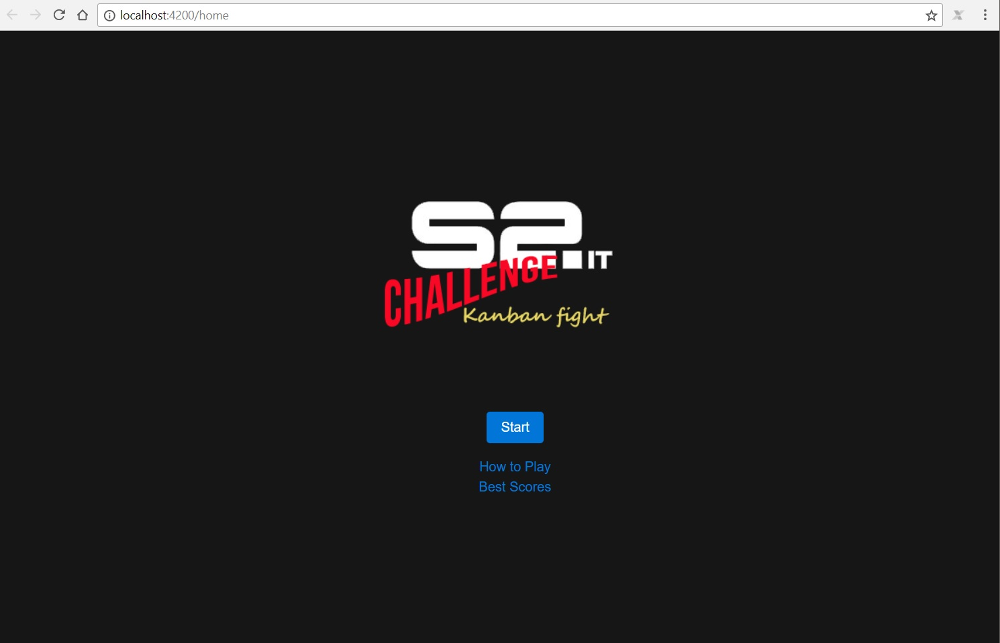
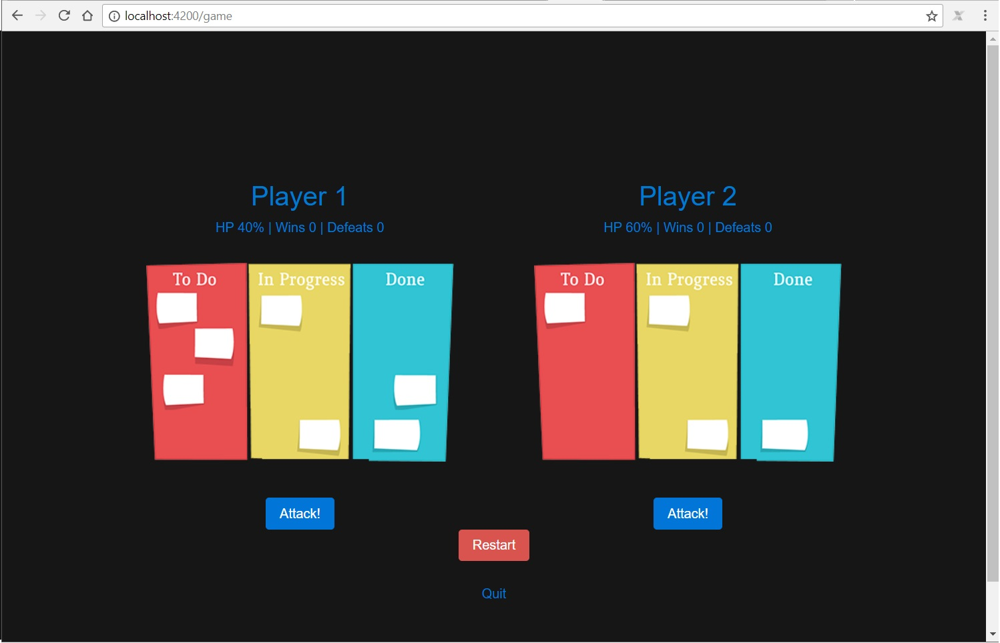

# DESAFIO - TESTE FRONTEND S2IT

# Especificação do Teste Proposto

Você deve implementar um jogo, onde o jogador que ficar com 0% de vida perde.

### O teste deve conter as seguintes features:

* Cada jogador deve começar com 100% de vida
* Dois botões, sendo um para cada jogador poder atacar o adversário
* Cada ataque remove 20% de vida do jogador adversário
* Um botão para reiniciar o jogo
* Quando o jogador ficar com 0% de vida, deve exibir uma mensagem informando quem é o vencedor

Abaixo segue o mock da tela:


### Dicas

Lembre-se que isto é apenas um mock e nós estamos aberto a novas ideias.

Não é regra usar frameworks, mas caso queira, tente usar os mais novos.

O design é muito importante, mas o UX é mais.

Testes também fazem a diferença.

#### Faça um fork deste repositório e boa sorte!

# Solução Desenvolvida - S2.it Chalenge - Kanban fight

## A Solução

Como solução ao desafio foi desenvolvido um jogo intitulado **S2.it Chalenge - Kanban fight**. 

O jogo **S2.it Chalenge - Kanban fight** permite que dois jogadores testes suas habilidades de velocidade com o teclado ou mouse. Para isso, ambos deverão lutar para preencher o kanban do inimigo. Vence, aquele que conseguir realizar tal tarefa mais rapidamente. 

Há duas possibilidades de controle do jogo: 
1. Atacar o inimigo por meio do botão de *Attack* ou;
2. Utilizar as teclas "S" para o jogador 1 e tecla "L" para jogador 2.

Ao sair do jogo é possível registrar o nome do jogador com maior número de vitórias. Tais vitórias podem ser consultadas no menu inicial, oção *Best Scores*


*Tela Inicial da Solução<*


*Tela do Jogo*

## Informações Técnicas do Projeto

O projeto foi desenvolvido utilizando o framework JavaScript Angular 5. Sua escolhe se deve à familiarização do desenvolvedor com o mesmo.

A estrutura principal das pastas e consequentemente dos componentes desenvolvidos presentes no projeto em *desafio/src/app/* são descritos abaixo:

* Diretório */schemas* - *Inclui as classes que definem os atributos dos jogadores e da score*;
* Diretório */shared/services* - *Inclui os serviços comuns a todos os compomentes, tais como as caixas de diálogos, configurações gerais do jogo e arquivo para internacionalização.*
* Diretório */components/* - *Inclui todos os componentes desenvolvidos para o jogo.*
    * */components/score* - *componente que apresenta as pontuações dos jogadores. Tais pontuações são salvas no localStorage do browser do usuário e podem ser excluídas na tela do mesmo componente.*
    * */components/pre-game* - *componente da tela inicial do jogo. Permite acesso as melhores pontuações (Best Scores) bem como à informações de como jogar (How to Play). Finalmente, também apresenta o botão de início (Start - componente flow-control-button) para iniciar o jogo.*
    * */components/player* - *componente apresentado na tela do jogo (componente game) com as informações dos jogadores 1 e 2.*
    * */components/how-to-play* - *componente que é acessado via tela inicial (componente pre-game) e exibe informações do jogo.*
    * */components/game* - *componente principal da solução. Apresenta a tela de jogo com os botões de ataque (componentes damage-button) e tela para reiniciar o jogo (componente flow-control-button). Possuí também o botão para sair do jogo.*   

## Executando o Projeto

Para executar o projeto é necessário instalar o Angular CLI em um ambiente pré configurado com [node.js](https://nodejs.org/en/download/) para isso deve-se executar o comando:

```npm install -g @angular/cli´´´.

Após instalação do Angular, acessar a pasta principal do projeto (*/desafio*) ou subpastas do mesmo e executar o comando abaixo para instalar as dependências:

```npm install´´´

Finalmente, para execução do jogo, utilizar o comando:

```ng serve -o´´´

Para execução dos testes utilizando Karma/Jasmine, já incluídos nos pacotes de dependência do projeto, utilizar o comando:

```npm test´´´


